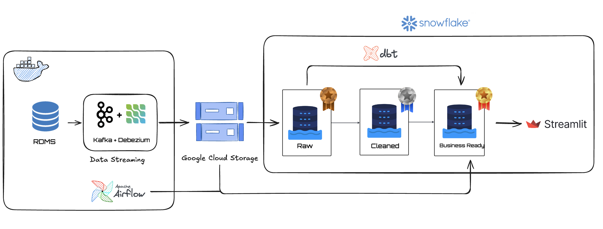
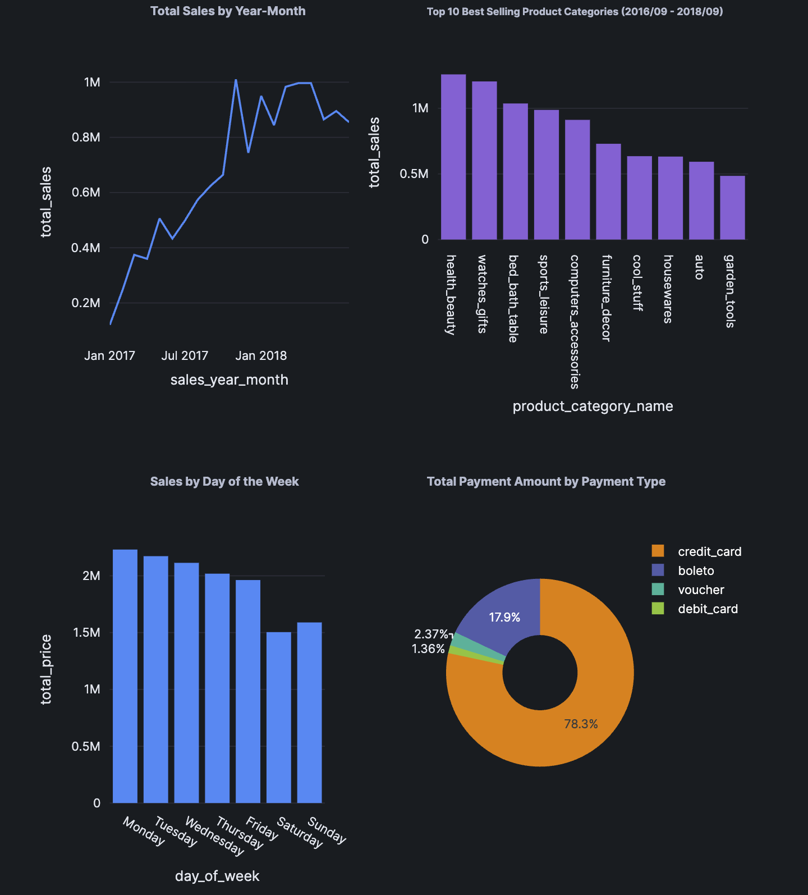
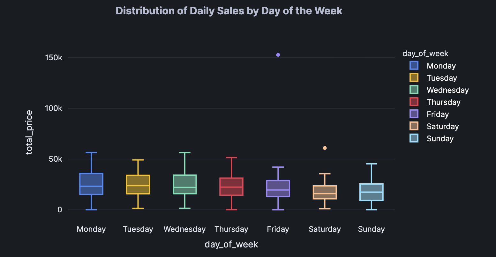
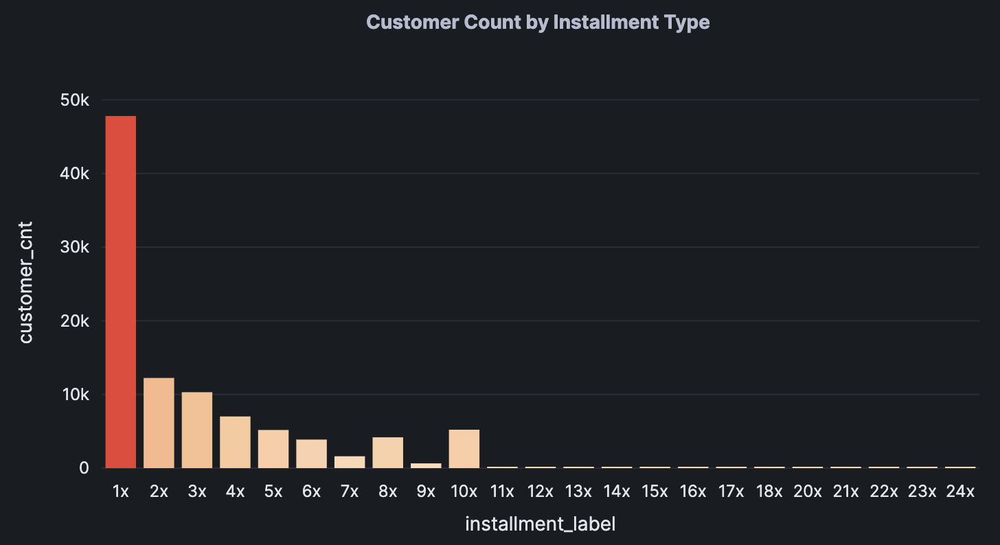

# Olist E-Commerce Data Pipeline & Analytics

A full end-to-end pipeline that captures changes from a PostgreSQL e-commerce database, streams them through Kafka to Google Cloud Storage, ingests into Snowflake, and transforms raw data into a star schema for analytics.

## Overview
Built on the Olist Brazilian E-Commerce dataset (~100k orders), this project connects every layer of a modern data stack: Debezium captures row-level changes from PostgreSQL, Kafka streams them to a consumer that writes Parquet files to GCS, and Snowpipe auto-ingests into Snowflake's raw layer. From there, Airflow orchestrates dbt transformations through staging into dimensional models (5 dimensions, 2 fact tables), powering a Streamlit dashboard with sales KPIs, geographic breakdowns, and payment analysis.


## Tech Stack


                            
                                         


## Architecture


## Star Schema


## Analytics Dashboard





## Key Features
- **Change Data Capture** — Debezium captures row-level changes from PostgreSQL via logical replication, streaming inserts to Kafka topics     
- **Event streaming** — Kafka consumer batches CDC events into Parquet files before writing to GCS, decoupling ingestion from transformation
- **Auto-ingestion** — Snowpipe with GCS Pub/Sub notifications loads Parquet files into Snowflake's raw layer without manual triggers
- **Medallion architecture** — dbt transforms data through raw → staging (9 models) → dimensions (5) and facts (2) in a star schema
- **Orchestration** — Airflow DAGs with Dataset-based dependencies: staging runs daily, marts rebuild automatically on staging completion
- **Analytics dashboard** — Streamlit app in Snowflake with sales KPIs, geographic choropleth, trend lines, and payment breakdowns
- **Synthetic data generation** — Transaction generator creates new orders in PostgreSQL to test the pipeline end-to-end

## Repository Structure
<details>
<summary>click to expand</summary>

```bash
olist-ecommerce-end-to-end-pipeline/                                      
├── consumer/   
│   └── kafka_to_gcs.py                        # Kafka consumer → Parquet → GCS           
├── data-generator/                            
│   └── transactions_generator.py               # Synthetic order
generator
├── docker/
│   └── dags/
│       ├── dbt_staging_to_snowflake.py         # Airflow DAG: staging models
│       └── dbt_dim_and_facts_to_snowflake.py   # Airflow DAG: dimension & fact models
├── ecommerce_dbt/
│   ├── models/
│   │   ├── staging/                            # 9 staging models (stg_*)
│   │   ├── marts/
│   │   │   ├── dimensions/                     # dim_customers, dim_dates, dim_orders, dim_products, dim_sellers
│   │   │   └── facts/                          # fact_sales, fact_payments
│   │   ├── ml/                                 # ML feature dataset
│   │   └── sources.yml
│   ├── seeds/
│   │   └── Brazil_states_regions.csv
│   └── dbt_project.yml
├── kafka-debezium/
│   └── generate_and_post_connector.py          # Debezium connector
config
├── postgres/
│   └── schema.sql                              # Source database schema
├── snowflake/
│   └── create_snowflake_pipes.py               # Snowpipe creation script
├── docker-compose.yml                          # Kafka, Zookeeper, Debezium, PostgreSQL, Airflow
├── dockerfile-airflow.dockerfile
├── snowflake_setup.sql                         # Snowflake storage integration & stages
├── streamlit_app.py                            # Analytics dashboard
└── requirements.txt

```

</details>